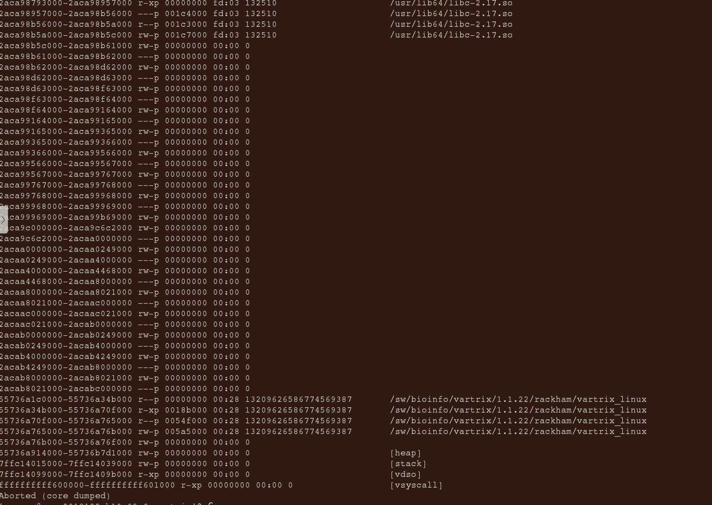
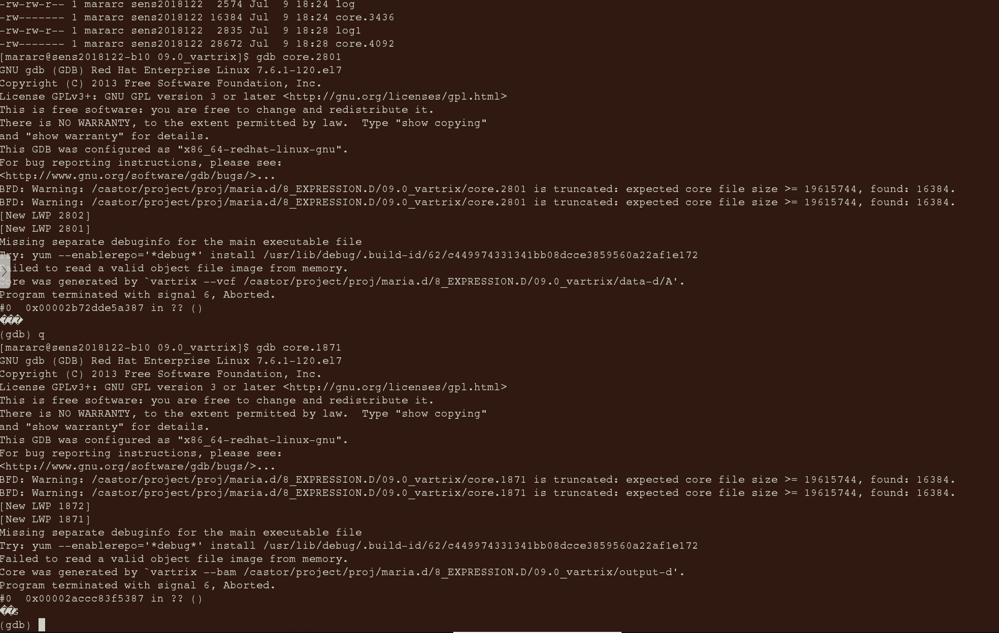
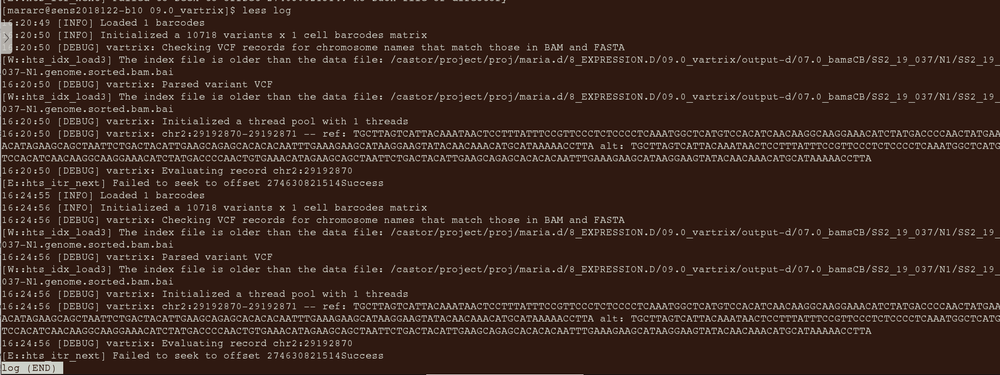

# ticket_296259


## 

Bash script from user [run.sh](run.sh).

The problem is in an early line:

```bash
samtools view -b ${bamO} chr2 > SS2_19_037-H13_chr2.bam
```

This is a problem as a samtools view is not in the same format as a BAM
file. Using this line instead brings us closer to the truth:

```bash
samtools view -b ${bamO} chr2 > SS2_19_037-H13_chr2.sam
```

This is because a SAM file is a plaintext format that samtools
renders to. However, the user does use the samtools `-b` flag,
which, according to [the documentation](https://github.com/samtools/samtools/blob/master/doc/samtools-view.1)
states `-b, --bam Output in the BAM format`

I hypothesize that `-b` is ignored when an output file is not 
specified (with the `-o` flag),
which can be tested by seeing if this would indeed create a BAM file:

```bash
samtools view --bam ${bamO} chr2 --output SS2_19_037-H13_chr2.bam
```

- [ ] Test hypothesis

This is, however, not the solution. Instead, I predict this will work:

```bash
samtools view ${bamO} chr2 > SS2_19_037-H13_chr2.sam
# Work on the SAM file
samtools view SS2_19_037-H13_chr2.sam --bam --output SS2_19_037-H13_chr2.bam
```

- [ ] Test hypothesis

User text on how to get a FASTA:

> Fasta (too large to send as attachment) downloaded from https://www.gencodegenes.org/human/release_37.html (Fasta files > genome sequence)

Indeed, the FASTA file can be downloaded from [https://www.gencodegenes.org/human/release_37.html](https://www.gencodegenes.org/human/release_37.html),
which links to [https://ftp.ebi.ac.uk/pub/databases/gencode/Gencode_human/release_37/GRCh38.p13.genome.fa.gz](https://ftp.ebi.ac.uk/pub/databases/gencode/Gencode_human/release_37/GRCh38.p13.genome.fa.gz).
I put that in a script [get_fasta.sh](get_fasta.sh).

- [ ] Verify `SS2_19_037-H13_chr2.bam` is a valid BAM file
    - `cat SS2_19_037-H13_chr2.bam` indeed shows a binary file
    - `samtools quickcheck SS2_19_037-H13_chr2.bam` gives no error
    - `samtools quickcheck -vvv SS2_19_037-H13_chr2.bam` gives no error and some good output:

```
richel@richel-N141CU:~/GitHubs/ticket_296259$ samtools quickcheck -vvv SS2_19_037-H13_chr2.bam
verbosity set to 3
checking SS2_19_037-H13_chr2.bam
opened SS2_19_037-H13_chr2.bam
SS2_19_037-H13_chr2.bam is sequence data
SS2_19_037-H13_chr2.bam has 116 targets in header.
SS2_19_037-H13_chr2.bam has good EOF block.
```

- [ ] Run use script, reproduce problem


- [ ] Confirm that `samtools quickcheck` on the `SS2_19_037-H13_chr2.bam` created by the original script
      indicates a problem
- [ ] Confirmthat `java -jar $PICARD ValidateSamFile --INPUT java -jar $PICARD ValidateSamFile --INPUT user_filename.bam` 
      indicates a problem


## Meeting Monday 2024-08-05 10:00

Discuss:

- [x] Goal: how to be able to fix the problem, maybe the VarTrix developers are better to ask

It seems fixable: we concluded that the user's script converted a BAM file
to a text file. I can fix that script :-)

- [x] Validate BAM file

```bash
module load bioinfo-tools
module load vartrix/1.1.22
module load picard/3.1.1
java -jar $PICARD ValidateSamFile --INPUT user_filename.bam
```

We found out the BAM file was not a binary file at all!
Instead, it was a text file in the same format as `samtools view` gives.

- [/] What is the history of the BAM file? Goal: reproduce problem on public BAM file

The user will send me her script

- [x] I've creates an Issue at VarTrix: [Help find problematic file with error 'Failed to seek to offset'](https://github.com/10XGenomics/vartrix/issues/124)

Not needed.

- [x] Decide upon plan

    - User sends script and subsetted BAM file before 14:00
    - Richel works on the fix
    - Next meeting: Tuesday Aug 6th 14:00

### Solution

I predict there is something wrong with the bam input file.
The user thinks so to ([see communication of 2024-08-02](#2024-08-02)).
The bam input file cannot be shared.

However, it can be validated (code from [the UPPMAX documentation on Picard](https://docs.uppmax.uu.se/software/picard/)):

```bash
module load bioinfo-tools
module load vartrix/1.1.22
module load picard/3.1.1
java -jar $PICARD ValidateSamFile --INPUT $VARTRIX_TEST/test_dna.bam
```

The user tried to delete the analysis files
and started the analysis from scratch again,
but I am unsure if this was correct ([see communication of 2024-08-02](#2024-08-02))

- [ ] I've creates an Issue at VarTrix: [Help find problematic file with error 'Failed to seek to offset'](https://github.com/10XGenomics/vartrix/issues/124)

### Problem

> I am trying to run vartrix in Bianca.
> The program seems to work fine when I try the test run (files in $VARTRIX_TEST) but crashes when I use my input files.
> The errors I get:
> "Failed to seek to offset ((some number))"
> "Segmentation fault. Core dump" and I get a core.XXXX file. When I check the core.XXXX with gdb it says that it "Failed to read a valid object file image from memory" and "Program terminated with signal 6"
> I have no idea what it is trying to tell me. Could you maybe help me?
> (attached screenshots)







## Notes

I assume this is about the Rust program called vartrix at [https://github.com/10XGenomics/vartrix](https://github.com/10XGenomics/vartrix).

A GitHub seach on `Failed to seek to offset`:


 * [UNRESOLVED] [https://github.com/mflamand/Bullseye/issues/2#issuecomment-1067969449](https://github.com/mflamand/Bullseye/issues/2#issuecomment-1067969449)
 * [UNRESOLVED] [https://github.com/GMOD/jbrowse-components/issues/1990#issuecomment-844406099](https://github.com/GMOD/jbrowse-components/issues/1990#issuecomment-844406099)

I feel the problem is in [https://github.com/samtools/htslib](https://github.com/samtools/htslib), due to this PR:

 * [https://github.com/samtools/htslib/pull/1504](https://github.com/samtools/htslib/pull/1504)

Lines of code are at:

 * [https://github.com/samtools/htslib/blob/master/hts.c#L4182](https://github.com/samtools/htslib/blob/master/hts.c#L4182)
 * [https://github.com/samtools/htslib/blob/master/hts.c#L4203](https://github.com/samtools/htslib/blob/master/hts.c#L4203)

Both work on a `BGZF` pointer, a structure 
defined at [https://github.com/samtools/htslib/blob/develop/htslib/bgzf.h#L68](https://github.com/samtools/htslib/blob/develop/htslib/bgzf.h#L68).

As the user can get to work testing files, I feel it is most likely that the user's input files are in an invalid format.

I contacted the VarTrix maintainers to help me and the user diagnose the faulty file at [this Issue](https://github.com/10XGenomics/vartrix/issues/124).

## Communication


### 2024-08-02

From the user:

> The command I used to run a test in Vartrix:

```console
$ module load bioinfo-tools
$ module load vartrix/1.1.22
$ ls -ltr $VARTRIX_TEST/*
$ vartrix --bam $VARTRIX_TEST/test_dna.bam \
  --cell-barcodes $VARTRIX_TEST/dna_barcodes.tsv \
  --fasta $VARTRIX_TEST/test_dna.fa \
  --vcf $VARTRIX_TEST/test_dna.vcf
```

> Trying to remove all analysis files:
> there are none created, I checked with '''ls -altr''' and I see nothing
> 
> Input files:
> I agree in that it is, most likely, my input files.
> My input bams have been tinkered with, because my bam files are output coming from RSEM and they are missing the CB tag needed by Vartrix (as Vartrix takes bam files with CellRanger format)
> I used java/jvarkit to add the CB tag to my RSEM bams
> I also modified the vcf file to tailor it to what we need, but when I compare it to the test vcf file they seem to have the same format

> Sharing my inputs:
> I'm not sure I can share my bam as it is sensitive information, but I have it in Bianca, so maybe you can access that directory?
> For the remaining files I could send you a link to a tar in OneDrive, would that work?
```
